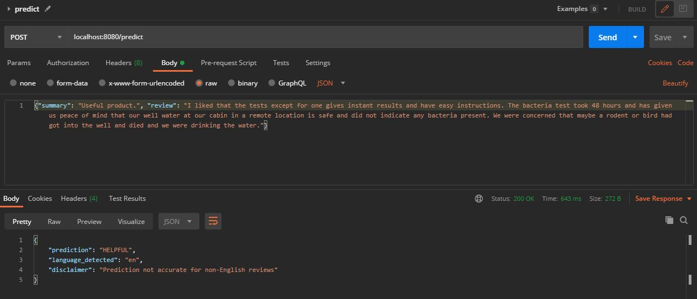

# Predicting Helpfulness of Amazon Product Reviews

Data source: https://nijianmo.github.io/amazon/index.html

## Folder Layout
- `app/`: folder containing a Flask app that exposes an endpoint for obtaining model prediction on a review 
- `artifacts/`: where model artifacts and logs from the model development steps should be saved, broken out by modeling approach tried (i.e. Naive Bayes, feed-forward neural network)
- `data/`: where data should be saved, broken out by `raw` (.json.gz files from original source), `intermediate` (results from intermediate processing steps) and `final` (used for modeling)
- `mlruns/`: used by `mlflow`, which was the tool for tracking results of experiments
- `src/`: code for data prep and modeling (`data_prep` and `models` subfolders, respectively). See `run.sh` for the order of execution of the pipeline
- `tests/`: tests for scripts in `src`
- `requirements.txt`: lists dependencies
- `run.sh`: bash script for running the data processing and model development pipeline

## How to Run

To run the data processing and model development steps, first install the dependencies listed under `requirements.txt`, then follow `run.sh`.

To run the app with Docker, use the following commands:

```
cd app
docker build -t reviews_app . 
docker run -p 8080:8080 -d reviews_app
```

API documentation can be found at the "docs" endpoint:


To obtain a prediction with a POST request using Postman:

