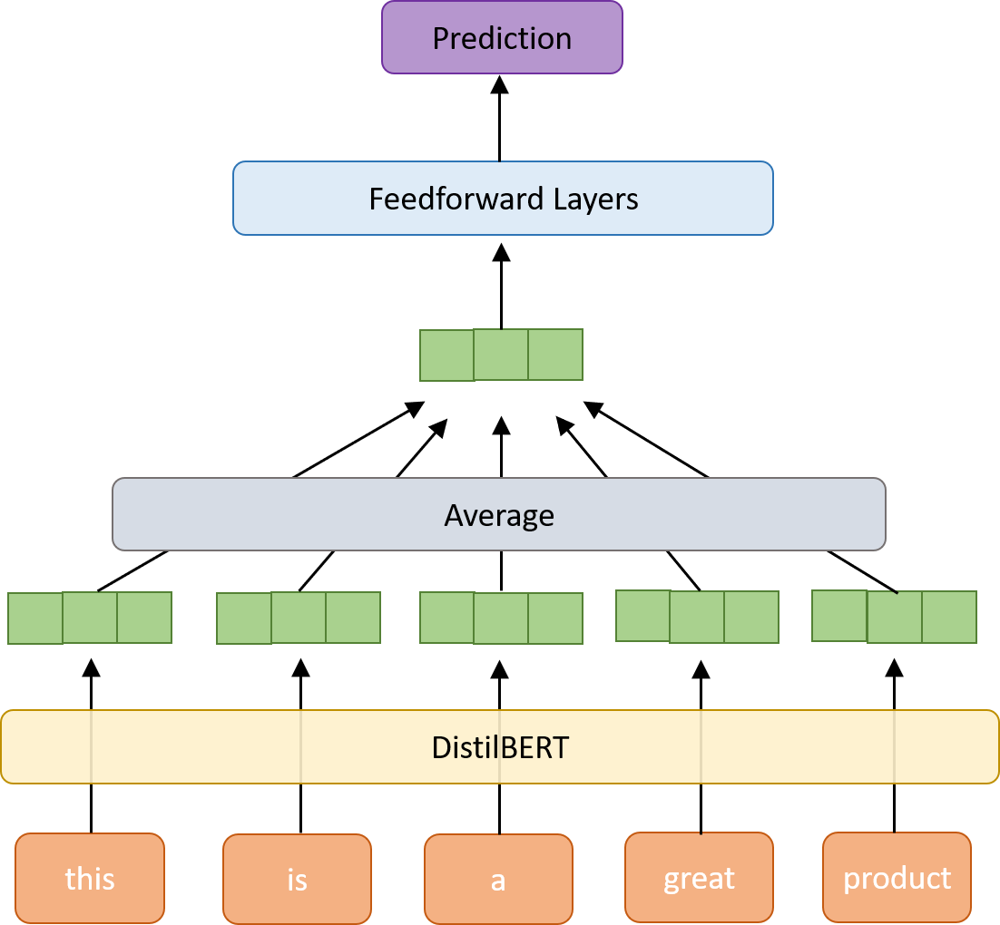

## Introduction

This project explores my approach to predicting the helpfulness of Amazon product reviews. The final model is built to classify products in the Clothing Shoes and Jewelry category with 88% accuracy and 0.37 f1 score. Features were extracted from review text and fed into both a Naive Bayes and a feedforward network model, complete with hyperparameter tuning. To ensure the whole pipeline can be executed on a single machine in a reasonable time frame, several techniques were employed, including processing the data in chunks, taking a random subsample and choosing model architectures that have been shown to be efficient and effective.

Tools used: `pandas`, `sklearn`, `spacy`, `transformers`, `PyTorch` and `mlflow`. 

## Dataset

The [Amazon reviews dataset](https://nijianmo.github.io/amazon/index.html) is broken out by product categories. Given limited time and resources, I focused on the Clothing Shoes and Jewelry category, which is one of the biggest categories by review count. I chose to focus on one single category instead of sampling across different product categories, in case there are systematic differences in the contents of reviews and what constitutes a helpful review by product category. Additionally, I used the 5-core version of the dataset, which is limited to products and users with at least 5 reviews, to reduce noisiness of the data and to try to exclude more recent reviews that had less chance to be voted on by readers.

## Process
### Label
The dataset does not provide the number of unhelpful votes on reviews (which seems to have been available in older versions) and number of views, which makes it difficult to normalize the helpfulness of a review by how many people have seen it and the opinion polarity. Seeing that most reviews do not receive any votes, I chose to structure the problem as a binary classification task, with any review that has received at least one helpfulness vote counting as "helpful", and any review without any votes as "unhelpful".

### Preprocessing
Before the data can be used for any model training, some preprocessing is required. Firstly, the JSON review objects needed to be collated into tabular format for easier data munging. Next, the non-English reviews and blank reviews were removed (they represent a small percentage of the dataset), since a lot of model features will be based on the choice of words from the reviews.

To handle the large volume of reviews, data was read in, processed, and with results written out in chunks where possible. To speed up the model training process, a round of subsampling was applied to the dataset to keep 35% of the original data volume of ~11M records (25% for training, 5% for validation, 5% for testing).

Since there is a fairly high level of class imbalance (~90%+ of reviews never received any votes for being helpful), and some classifiers work better when the classes are more balanced, downsampling was applied to the majority class of the training set to create a balanced dataset (an alternative approach would be to assign a higher weight to observations from the rarer class in the loss function).

### Features
Two methods are applied to transform the reviews (summary and review fields combined) into vector representations: (1) [TF-IDF](https://en.wikipedia.org/wiki/Tf%E2%80%93idf), and (2) word embeddings from a pretrained language model (i.e. [DistilBERT](https://huggingface.co/transformers/model_doc/distilbert.html)). The first is a classic approach to representing text as a bag of words, in which each word is turned into a measure of frequency downweighted by how common the term is across the training corpus. It is a simple yet often effective technique for modeling textual data, but benefits from more data cleaning, including lemmatization.

BERT is a bidirectional transformer model pretrained on a large and diverse set of text and has shown to be very effective for being adapted to downstream NLP tasks. DistilBERT is a more lightweight model (66M parameters) trained to learn the behavior of the BERT model (110M parameters). I chose to use DistilBERT because it is less resource-intensive to work with while preserving most of the performance of the full model. The implementation I used came from the `transformers` library, which also provides the WordPiece tokenizer for processing text.

I also experimented with engineering features from other fields provided in the dataset, such as whether the review included images, history of prior reviews by the same user, and popularity of the product, but did not get a chance to test them out due to time constraints.

## Models

For this project, I tried out two algorithms for the classifier: (1) [Naive Bayes](https://scikit-learn.org/stable/modules/naive_bayes.html) based on TF-IDF vectors, and (2) [feedforward neural network](https://cs.stanford.edu/people/eroberts/courses/soco/projects/neural-networks/Architecture/feedforward.html) from DistilBERT word embeddings. Based on the Bayes theorem, Naive Bayes is an efficient and popular non-neural network technique for text classification. Further, the `sklearn` implementation of Naive Bayes supports [incremental learning](https://scikit-learn.org/0.15/modules/scaling_strategies.html), which can be helpful when the dataset is too large to fit into memory. The architecture of the second technique is in the appendix. It was inspired by this [paper](https://arxiv.org/abs/1607.01759), which demonstrated that a simple shallow feedforward network can be highly effective for text classification tasks.

Hyperparameter tuning was applied to the feedforward network to test out the effects of learning rate and hidden dimension size of the layers. More extensive tuning, such as on the dropout rate, could help identify a more optimal configuration.

Results of models (on the held-out test set) are as follows. As shown, the neural network performs slightly better, but is a lot slower to train, so in practice, the choice between the two models is not clear.

| Model                                              | Accuracy | AUC   | F1    |
|----------------------------------------------------|----------|-------|-------|
| Naive Bayes (tf-idf vectors)                       | 0.876    | 0.770 | 0.308 |
| Feedforward Neural Network (DistilBERT embeddings) | 0.879    | 0.814 | 0.371 |

## Conclusion

To conclude, the classifier model on Amazon reviews under the Clothing Shoes and Jewelry category look promising. As for next steps, I would like to test the inclusion of more features aside from the text itself and explore the use of the attention mechanism so the model can learn to focus more on certain words, such as by fine-tuning on a BERT model (I tried this out but training took a long time and requires access to GPUs). I would also want to test how well the existing models work on reviews from other categories, and apply the same methodology to the remaining product categories, with the goal of a machine learning system that works on any given Amazon review.

## Appendix

Feedforward neural network architecture diagram:

